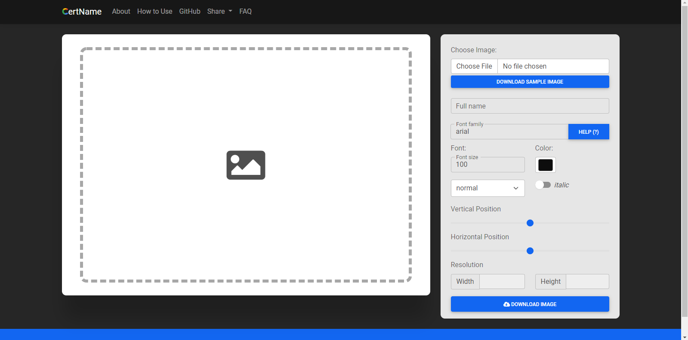

<p align="center">
  
  <h1 align="center">Certificate Name Generator</h1>
</p>

## What is Certificate Name Generator?
CertName Input is a simple application that can be used to easily enter the name on the certificate without having to use any image editor software. You only need to prepare a blank certificate image template file with no name, and then use this app to input the name directly and customize font position and color.

## Installation Instruction
1. Clone this repo.
```ps
git clone https://github.com/bagiosw/certificate-name-generator
```
This will create a local copy of the repo.

2. Open `index.html` file.
3. Start editing.

## Usage Instruction
1. Select a certificate image to be used. The recommended size is 3508 pixels x 2480 pixel, but you are free to use any size of certificate.
2. Enter the full name of the recipient.
3. Adjust the font size, color, and styling of the text.
4. Adjust the text vertical or horizontal position.
5. Click SAVE IMAGE.

## Screenshot
